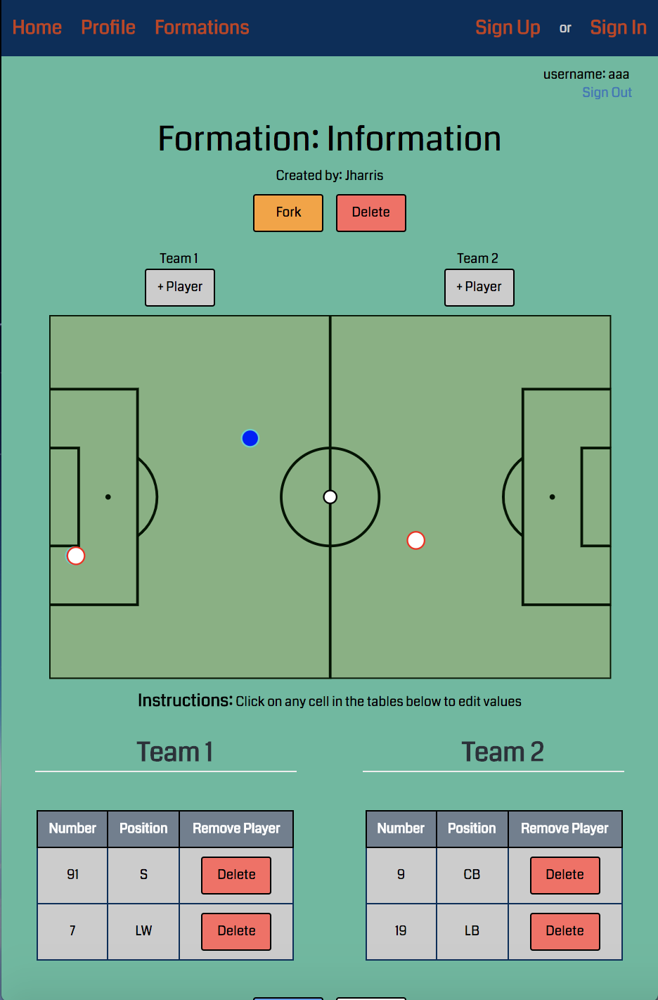
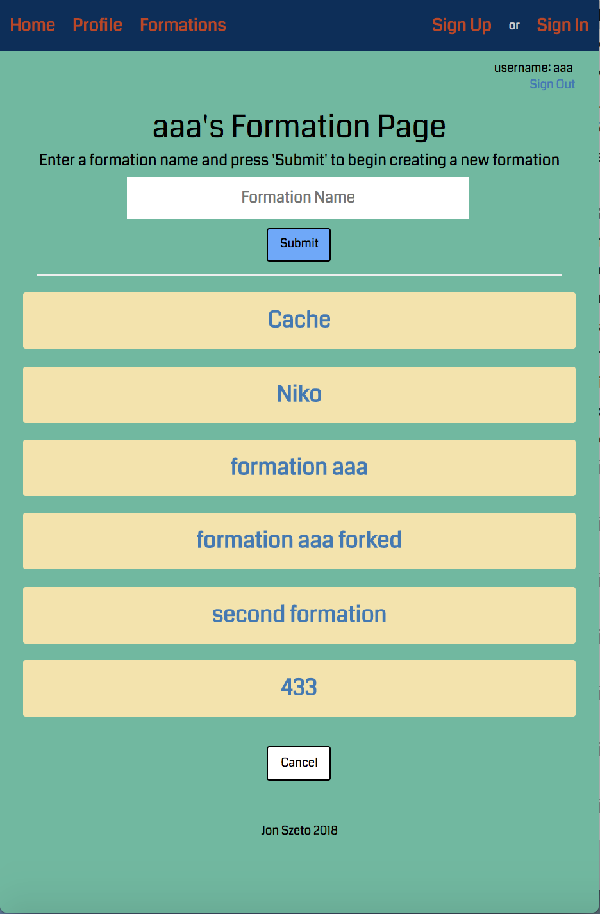

<h1>Soccer Tactics Board</h1>

An application that allows users to visualize strategy against the opposition, attacking/defending set piece formations, and how to play out in-game situations.

<h5>Application:</h5> https://soccertactics.herokuapp.com/
<h6>Demo Account</h6>
<h6>Username: PasswordIsTaco | Password: taco</h6>

<h3>Screenshots</h3>
<h5>Formation Page</h5>

<h5>Formation List</h5>

<h5>Instructions:</h5>
<ul>
	</li>
		Fork Formation
		<ul>
			<li>Navigate to formation page</li>
			<li>Click on 'Fork'</li>
			<li>Once prompt displays, enter name of formation</li>
			<li>Click 'OK'</li>
			<li>Navigate to your Profile page; forked formation will be listed with the new user input formation name</li>
		</ul>
	</li>
	</li>
		Create Formation
		<ul>
			<li>Log-in to account</li>
			<li>Navigate to Profile page</li>
			<li>Input a formation name in the input field</li>
			<li>Click 'Submit'</li>
			<li>User will be directed to a default formation page to begin working on a new formation</li>
		</ul>
	</li>
	</li>
		Save Formation
		<ul>
			<li>Make updates to formation or player table</li>
			<li>Click 'Save' button</li>
			<li>An alert will display to confirm formation updates have been saved</li>
		</ul>
	</li>
</ul>

<h3>Technology</h3>
<ul>
  <li>HTML (Handlebars.js)</li>
  <li>CSS</li>
  <li>JavaScript</li>
  <li>jQuery</li>
  <li>D3.js</li>
  <li>Express</li>
  <li>Passport</li>
  <li>Node.js</li>
  <li>Mongoose</li>
  <li>MongoDB</li>
</ul>

